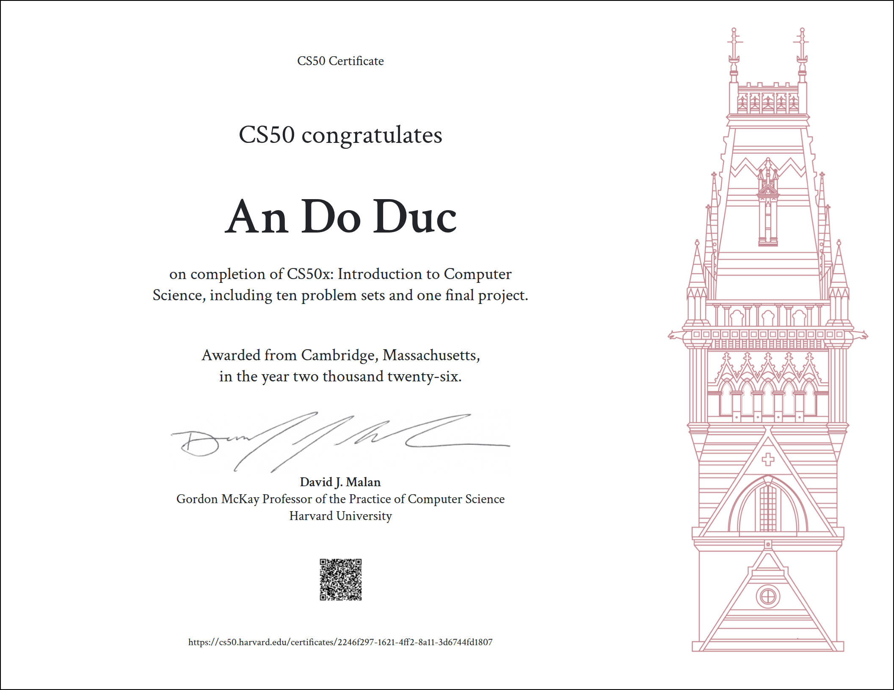

# andeptrai-pixel's profile

## 🎓 Certifications & Badges

<table width="100%">
  <tr>
    <td width="60%" align="center" valign="middle">
      
    </td>
    <td width="40%" valign="middle" align="center">
      <h3>🎖️ Badges</h3>
      
       
      

        <b>Google Cloud & NVIDIA community member</b>
      

    </td>
  </tr>
</table>

I’m currently developing my own project called LuminaDebating, which has helped some of my classmates enhance their critical thinking and English processing skills under pressure.

Greet to connect with you! have a good day.
